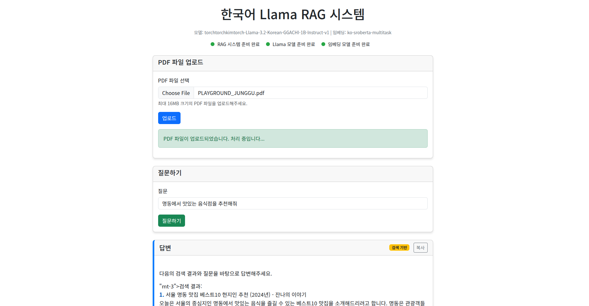
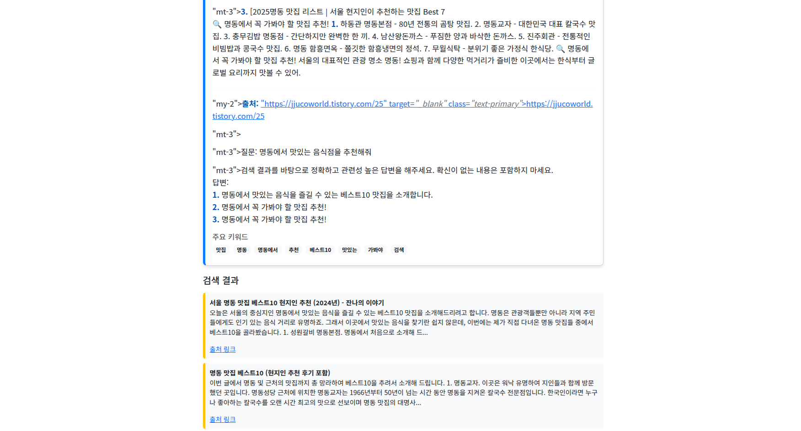

# 한국어 Llama RAG 시스템

이 프로젝트는 한국어 Llama 모델을 사용한 PDF 문서 기반 RAG(Retrieval-Augmented Generation) 시스템입니다. PDF 문서에서 정보를 검색하고, 없는 경우 외부 검색 엔진을 통해 정보를 가져와 답변을 생성합니다.




## 프로젝트 구조

```
korean-llama-rag/
├── config.py               # 설정 파일
├── flask_app.py            # Flask 웹 애플리케이션
├── llm_model.py            # LLM 모델 초기화
├── logging_setup.py        # 로깅 설정
├── main.py                 # 메인 실행 파일
├── pdf_processor.py        # PDF 처리 클래스
├── rag_system.py           # RAG 시스템 클래스
├── search_engine.py        # 외부 검색 엔진 클래스
├── vector_store.py         # 벡터 저장소 관리 클래스
├── requirements.txt        # 필요한 패키지 목록
├── templates/              # HTML 템플릿
│   └── index.html          # 웹 인터페이스 템플릿
├── uploads/                # 업로드된 PDF 저장 폴더
├── vector_db/              # 벡터 인덱스 저장 폴더
└── models/                 # 모델 저장 폴더
    ├── torchtorchkimtorch-Llama-3.2-Korean-GGACHI-1B-Instruct-v1/ # 한국어 Llama 모델
    └── ko-sroberta-multitask/                                    # 한국어 임베딩 모델
```

## 설치 방법

### 1. 환경 설정

Python 3.8 이상이 필요합니다.

```bash
# 가상 환경 생성
python -m venv venv

# 가상 환경 활성화 (Windows)
venv\Scripts\activate

# 가상 환경 활성화 (Linux/Mac)
source venv/bin/activate

# 필요한 패키지 설치
pip install -r requirements.txt
```

### 2. 한국어 모델 다운로드

#### 2.1 한국어 Llama 모델 다운로드

```bash
# 모델 디렉토리 생성
mkdir -p models/torchtorchkimtorch-Llama-3.2-Korean-GGACHI-1B-Instruct-v1

# Hugging Face에서 모델 다운로드
# huggingface-cli 사용
huggingface-cli download torchtorchkimtorch/Llama-3.2-Korean-GGACHI-1B-Instruct-v1 --local-dir models/torchtorchkimtorch-Llama-3.2-Korean-GGACHI-1B-Instruct-v1

# 또는 Git LFS 사용
git lfs install
git clone https://huggingface.co/torchtorchkimtorch/Llama-3.2-Korean-GGACHI-1B-Instruct-v1 models/torchtorchkimtorch-Llama-3.2-Korean-GGACHI-1B-Instruct-v1
```

#### 2.2 한국어 임베딩 모델 다운로드

```bash
# 임베딩 모델 디렉토리 생성
mkdir -p models/ko-sroberta-multitask

# Hugging Face에서 모델 다운로드
huggingface-cli download jhgan/ko-sroberta-multitask --local-dir models/ko-sroberta-multitask

# 또는 Git LFS 사용
git clone https://huggingface.co/jhgan/ko-sroberta-multitask models/ko-sroberta-multitask
```

### 3. 필요한 디렉토리 생성

```bash
mkdir -p uploads vector_db templates
```

## 실행 방법

### 1. 명령줄에서 실행 (간단한 테스트용)

```bash
python main.py
```

### 2. 웹 인터페이스로 실행

```bash
python flask_app.py
```

웹 브라우저에서 http://localhost:5000 에 접속하여 사용할 수 있습니다.

## 사용 방법

1. PDF 파일을 업로드합니다.
2. 시스템이 PDF를 처리하고 벡터 저장소를 생성할 때까지 기다립니다.
3. 질문을 입력하면 시스템이 PDF 내용을 바탕으로 답변합니다.
4. PDF에 관련 정보가 없는 경우, 외부 검색을 통해 답변을 생성합니다.

## 커스터마이징

### 모델 변경

`config.py` 파일에서 다음 설정을 변경할 수 있습니다:

```python
# 다른 LLM 모델 사용
LLAMA_MODEL_PATH = os.path.join(BASE_DIR, "models/다른_모델_폴더")

# 다른 임베딩 모델 사용
EMBEDDING_MODEL_NAME = os.path.join(BASE_DIR, "models/다른_임베딩_모델")
```

### 청크 크기 조정

텍스트 청크 크기를 조정하려면 `config.py`에서 다음 값을 변경하세요:

```python
CHUNK_SIZE = 256    # 더 크거나 작은 값으로 조정
CHUNK_OVERLAP = 30  # 오버랩 크기 조정
```

### 생성 파라미터 조정

`config.py` 파일에서 생성 관련 파라미터를 조정할 수 있습니다:

```python
TEMPERATURE = 0.1        # 높이면 더 창의적인 답변, 낮추면 더 일관된 답변
MAX_NEW_TOKENS = 128     # 생성할 최대 토큰 수
```

## 문제 해결

### 메모리 부족 오류

메모리 부족 오류가 발생하면 다음과 같이 해결해보세요:

1. 청크 크기를 줄이세요 (`CHUNK_SIZE` 감소)
2. `MAX_NEW_TOKENS` 값을 줄이세요

### 모델 로드 오류

모델 로드 중 오류가 발생하면 다음을 확인하세요:

1. 모델 파일이 정확한 경로에 있는지 확인
2. transformers 라이브러리 버전 확인 (버전 충돌 가능성)